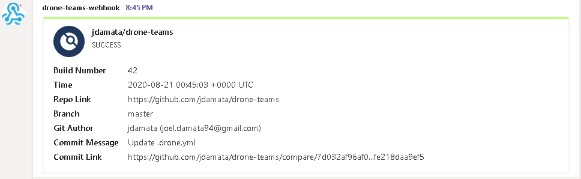

drone-teams is developed by Joel Damata.  
https://github.com/jdamata/drone-teams

It's added support for the AdaptiveCard format and new webhook(workflow / powerautomate).

### Drone Pipeline Usage

```yaml
- name: teams-webhook
  image: gniang/drone-teams
  settings:
    webhook: <WEBHOOK ENDPOINT>
    card: "adaptive"
```

---

====================================== Original Readme ======================================


# drone-teams

Drone plugin to send teams notifications for build status

## Build

Build the binary with the following command:

```console
export GOOS=linux
export GOARCH=amd64
export CGO_ENABLED=0
export GO111MODULE=on

go build -a -tags netgo -o release/linux/amd64/drone-teams ./cmd/drone-teams
```

## Docker

Build the Docker image with the following command:

```console
docker build \
  --label org.label-schema.build-date=$(date -u +"%Y-%m-%dT%H:%M:%SZ") \
  --label org.label-schema.vcs-ref=$(git rev-parse --short HEAD) \
  --file docker/Dockerfile.linux.amd64 --tag jdamata/drone-teams .
```

## Usage

```console
docker run --rm \
  -e PLUGIN_WEBHOOK=<WEBHOOK ENDPOINT> \
  jdamata/drone-teams
```

## Drone Pipeline Usage

```yaml
- name: teams-webhook
  image: jdamata/drone-teams
  settings:
    webhook: <WEBHOOK ENDPOINT>
```


